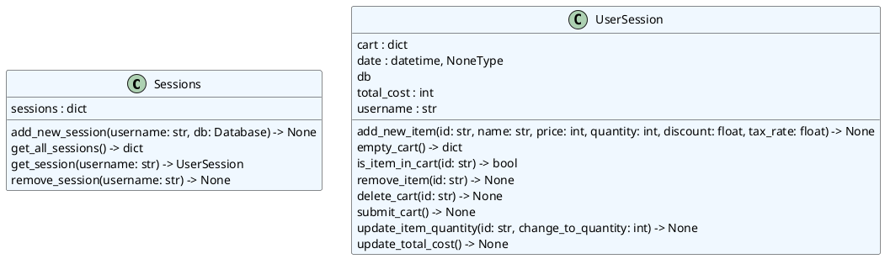
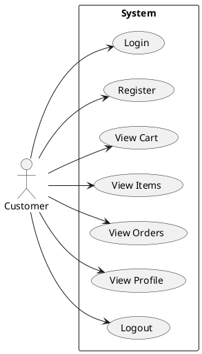
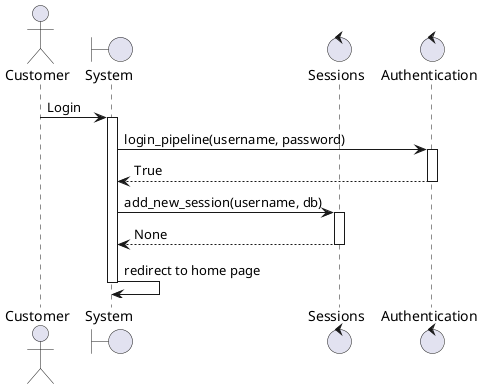

# Project 2: Design

## Introduction

In this phase, you will be mapping out your project and creating easily understandable diagrams that will help you and your team know your codebase inside and out. This also makes it much easier to communicate the flow of your application to less technical audiences or anyone who is new to your project. We will be using `pyreverse` and `plantuml` to help us create, update, and visualize our diagrams.

This activity will require you to generate Class, Package, Use Case, and Sequence diagrams for your project. If you are unfamiliar with these diagrams, you can find an in-depth explanation of each diagram type [here](https://www.uml-diagrams.org/) or reference [this article](https://nulab.com/learn/software-development/uml-diagrams-guide/).

## Task 1: Installations

- Use `pip` to install the following packages:
  - `pylint==2.17.1`
  - `plantuml==0.3.0`
- Add both of these packages to your `requirements.txt` file, including the version numbers. Follow the format of the `flask` package in the file.
- Install `Graphviz` on your machine. You can find download instructions for your operating system [here](https://graphviz.org/download/).

## Task 2: Initial Structure Diagrams

- Each group member will create diagrams for at least one of the following subdirectories/files of your project:
  - `authentication`: requires a package diagram
  - `core`: requires both a package diagram and a class diagram
  - `database`: requires both a package diagram and a class diagram
  - `testing`: requires a package diagram

All of the above diagrams must be generated, so split this work evenly and push and pull code often. To generate a class diagram for a subdirectory or file, you must first generate the `plantuml` files using `pyreverse`. Then, you must use `plantuml` to generate the diagram from the `plantuml` file. Here's an example of how to do this for the package diagram in the `testing` subdirectory.

```bash
pyreverse --output puml --colorized -A --output-directory testing testin # generates testing/package.puml
python3.10 -m plantuml testing/package.puml # generates testing/package.png
```

Since `testing` has no classes, we do not need a class diagram, but if we did, we would change the `testing/package.puml` to `testing/classes.puml` in the last command.

- Delete the `.puml` files that do not have a corresponding `.png` file. For example, since `testing` has no classes, we would delete `testing/classes.puml`.
- For each subdirectory, create copies of the `.puml` and `.png` files with naming schemes that include `_initial` in the name.
  - For example, `testing/package.puml` would have a copy called `testing/package_initial.puml` and `testing/package.png` would have a copy called `testing/package_initial.png`.

## Task 3: Update Structure Diagrams

- Begin planning the implentations necessary to fulfill requirements listed in your `SRS.md` file.
- Go to the corresponding subdirectory, and update the `.puml` file to reflect the changes you have planned.
  - For example, by implementing a method called `delete_cart` in the `UserSession` class from `core`, my `core/classes.puml` file would look like the one shown below because I added a line to the `UserSession` class that says `delete_cart(id: str) -> None`.
  - [PlantUML class diagram documentation](https://plantuml.com/class-diagram)
- Be sure to regenerate the `.png` file for each subdirectory after you update the corresponding `.puml` file.



## Task 4: Use Case Diagrams

- Create a `diagrams` subdirectory from the project root directory, and navigate to it.
- Create a `cases` subdirectory from the `diagrams` subdirectory and navigate to it.
- For each user type (actor) mentioned in your `SRS.md` file, create an appropriately named `.puml` file showcasing the use cases for that actor.
  - For example, if I had an actor called `Customer`, I might create a file called `customer.puml` that looks like the template below.
  - [PlantUML use case diagram documentation](https://plantuml.com/use-case-diagram)
- Generate a `.png` file from the `.puml` file.
  - Remember, this will look something like: `python3.10 -m plantuml customer.puml`



## Task 5: Sequence Diagrams

- Create a `sequences` subdirectory from the `diagrams` subdirectory and navigate to it.
- For each of the use cases shown in your use case diagrams, create an appropriately named `.puml` file showcasing the sequence of events for that use case and generate its corresponding `.png` file.
  - For example, if I had a use case called `Login`, I might create a file called `login.puml` that looks like the template below.
  - [PlantUML sequence diagram documentation](https://plantuml.com/sequence-diagram)



## Submission Details

- On Canvas, submit the following:
  - the URL to your group's repository
